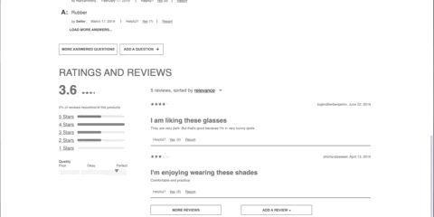
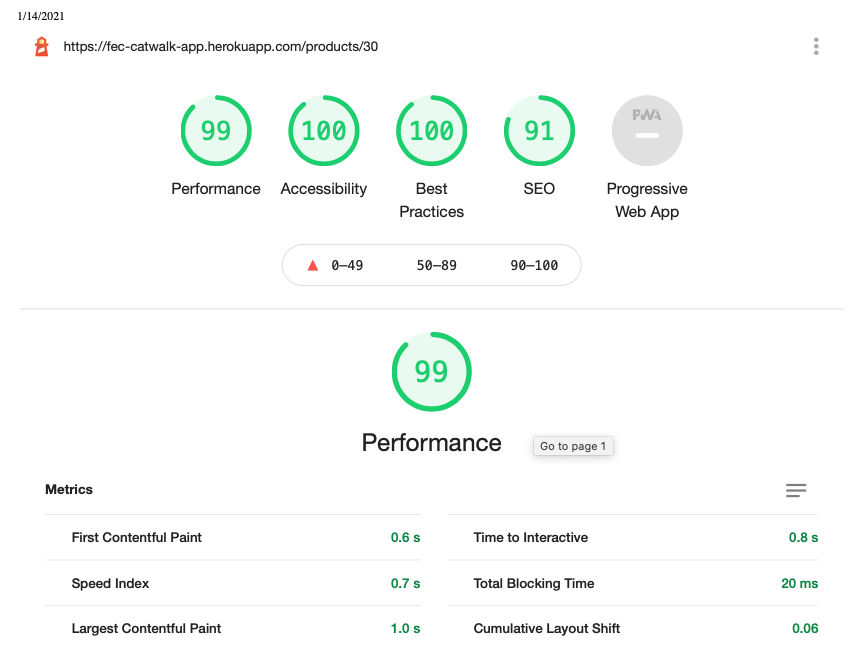

# Project Catwalk - Front-End Web App for an E-commerce retailer

[Live App](https://fec-catwalk-app.herokuapp.com/)

Project Catwalk is a front-end web app built by a team of 3 developers working remotely.  The styling and funcitonality was implemented according to guidlines set in a business requirement document.  The primary architecture is React for rendering of dom elements and interactivity with redux for state management.  The app is served via a simple express server and utilizes an existing back-end API to draw data/content from. The app has access to over 10000 unique products that can be loaded by typing a number (1-10000) in the search bar at the top right of the page and hitting the "enter/return" key.  React-router was also implemented to allow for dynamic url routing based on the current product.  (ex. requesting endpoint "/products/999" will load product number 999).

<kbd>

</kbd>

---

## Table of Contents
1. [Getting Started](#Getting-Started)
2. [Tech Stack](#Tech-Stack)
3. [Widgets](#Widgets)
4. [Web Performance](#Web-Performance)
5. [Contributors](#Contributors)

---

## Getting-Started

### Navigate to the root directory and run the following in your terminal:

>*Install dependencies:*
```
npm install
```

>*Create a .env file and set environment variables as necessary.   Expected environment variables:

*  **PORT** = The port the server will listen on *(if this variable is not provided server will default to 3005)*
*  **API_URL** = URL of the API that will provide data to the frontend app

>*Build client side bundle (compiles SASS to CSS and build webpack bundle):*
```
npm run build
```

>*Start the server:*
```
npm start
```

>*To run in development mode:*

```
npm run start-dev
```

---

## Tech-Stack

-  [Node.js - v12](nodejs.org)
-  [React - v17](https://reactjs.org/)
-  [Redux - v4](https://redux.js.org/)
-  [React-Router - v5](https://reactrouter.com)
-  [Express - v4](http://expressjs.com/)
-  [Node-Sass - v5](https://sass-lang.com/)

---

## Widgets

### Product Overview Widget
>  The Product Overview widget is the main area for users to view details about the current product (such as price, description, etc...).  Users can select a product style and view photos of that product style via a photo carousel.  Photos can be enlarged and zoomed in on for finer detail.  In the "Add to Bag" area, drop down menus will be auto-populated with the sizes and quantities available for that specific product style.

<kbd>
  
</kbd>
<br></br>

### Quesitons & Answers Widget
>  The Questions and Answers widget allows users to browse questions about the current product posed by other users along with any answers that have been provided for that quesiton.  Questions and answers can be marked helpful which will affect the order in whcih they appear.  They can also be reported which will remove them from results and flag them for review on the back-end.  Users can submit their own quesitons and answers via modal pop ups.  Quesitons can also be filtered via the searchbar at the top of the Quesitons and Answer widget.

<kbd>
  
</kbd>
<br></br>

### Ratings & Reviews Widget
> The Ratings and Reviews widget allows users to browse reviews for the current product which have been submitted by other users.  Reviews can be sorted by multiple criteria and an average rating is provided based on all reviews associated with the product.  Users can mark a review as helpful or report a review if necessary.  Finally, Users can submit their own review of the product via a modal.

<kbd>

</kbd>
<br></br>

---

## Web-Performance

> Several Optimization techniques were utilized to increase site performance including:

* Critical HTML & Style Loading
* Minification
* Gzip compression

<kbd>

</kbd>
<br></br>

---


## Contributors

- [Denis Sanches](https://github.com/shelleychenn)
- [David Lai](https://github.com/Eweiner11)
- [Joe DiMartino](https://github.com/mdoudy90)

## Credits

Boot-strapped with [createapp.dev](https://createapp.dev/)
